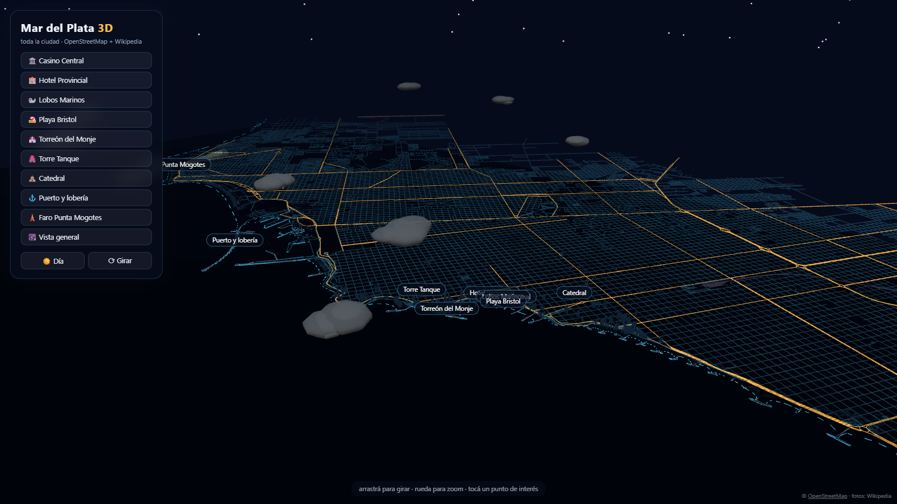
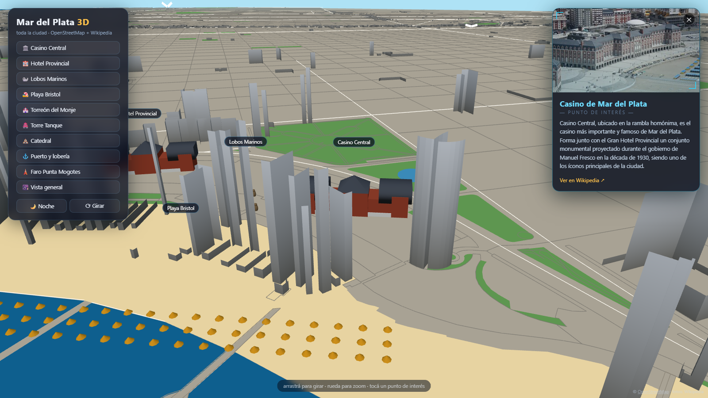

# Mar del Plata 3D

Mapa 3D interactivo de **toda la ciudad de Mar del Plata**, construido con datos reales de [OpenStreetMap](https://www.openstreetmap.org/) y [Three.js](https://threejs.org/). Cada punto de interés muestra **fotos y descripciones reales traídas en vivo de Wikipedia**.



## Qué incluye

- **9.948 calles y 6.665 edificios reales** extruidos desde OpenStreetMap (con alturas reales donde están cargadas y estimadas donde no)
- La costa, las playas, los espacios verdes, el ferrocarril y las escolleras reales
- Modelos artesanales de los íconos: **Casino Central, Hotel Provincial, lobos marinos, Torreón del Monje, Torre Tanque, Catedral, puerto con pesqueros y lobería, Faro Punta Mogotes** y las carpas de Playa Bristol
- **Panel holográfico**: al tocar un punto de interés se abre una ficha futurista con la foto y la descripción del lugar, consultadas en vivo a Wikipedia / Wikimedia Commons
- Autos circulando por las avenidas reales, gaviotas, nubes, olas animadas
- 🌙 Modo **día / noche**: calles que brillan, ventanas encendidas, estrellas y el haz del faro girando



## Funciones

- 📍 Recorridos de cámara a cada punto de interés (botones o click en las etiquetas)
- ⟳ Rotación automática
- Links directos: `?noche` y `?spot=casino|bristol|torreon|tanque|catedral|puerto|faro|lobos|provincial`

## Cómo correrlo

Es estático (Three.js desde CDN + binarios en `data/`). Cualquier servidor sirve:

```bash
npx serve .
```

## Regenerar los datos

```bash
npm install
node scripts/fetch-osm.mjs   # descarga OSM crudo a scripts/raw/
node scripts/build-data.mjs  # genera los binarios de data/
```

## Créditos

- Datos del mapa © colaboradores de [OpenStreetMap](https://www.openstreetmap.org/copyright) (ODbL)
- Fotos y textos de los puntos de interés: [Wikipedia en español](https://es.wikipedia.org/) y [Wikimedia Commons](https://commons.wikimedia.org/)
