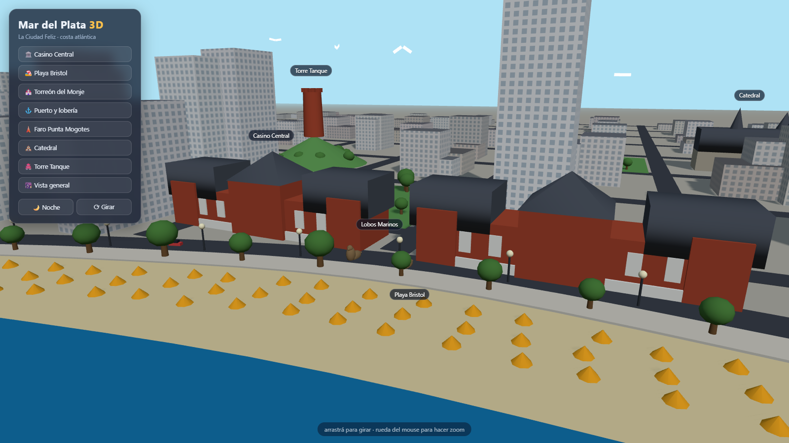

# Mar del Plata 3D

Mapa 3D interactivo y estilizado de Mar del Plata, hecho con [Three.js](https://threejs.org/). Inspirado en los mapas de ciudades en 3D generados con IA.



## Qué incluye

- **Playa Bristol** con sus carpas amarillas características
- **Casino Central y Hotel Provincial** (ladrillo rojo y techos de pizarra)
- **Lobos marinos** (las estatuas frente al casino y la lobería del puerto)
- **Torreón del Monje** sobre Punta Piedras
- **Puerto** con escollera de piedras, farito rojo, galpones y pesqueros naranjas
- **Faro Punta Mogotes** a rayas rojas y blancas, con haz de luz giratorio de noche
- **Catedral de los Santos Pedro y Cecilia** y **Torre Tanque**
- Trama urbana con la muralla de torres frente al mar, boulevard con autos, faroles, gaviotas, nubes y olas animadas

## Funciones

- 🌙 Modo **día / noche** (ventanas iluminadas, estrellas, faro encendido)
- 📍 Recorridos de cámara a cada punto de interés
- ⟳ Rotación automática
- Links directos: `?noche` y `?spot=N` (0 a 7)

## Cómo correrlo

Es un solo archivo HTML (Three.js se carga desde CDN). Cualquier servidor estático sirve:

```bash
npx serve .
# o
python -m http.server 8000
```

Y abrir `http://localhost:8000`.
